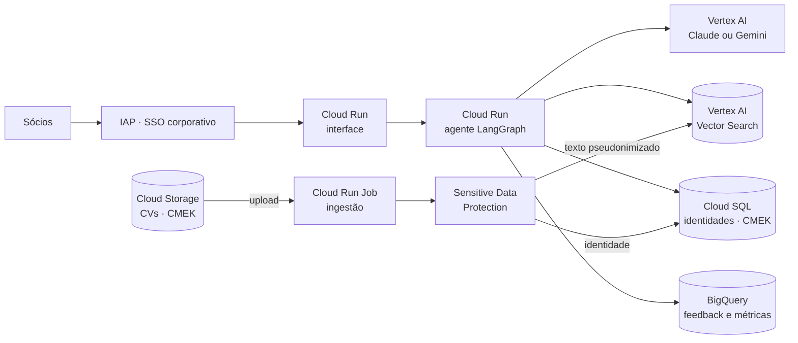

# Curadoria Executiva

Agente de IA para executive search: recebe a descrição de uma vaga C-Level, busca na base de
currículos e entrega um shortlist de três candidatos com parecer consultivo. Cada afirmação
do parecer é sustentada por um trecho do currículo, conferido em código.

O sistema apoia a decisão do sócio. Ele organiza a leitura e explicita os trade-offs; quem
decide continua sendo o sócio.

## Resultado nas vagas de teste

| Vaga | Esperado | Ranking produzido | Evidências confirmadas |
|---|---|---|---|
| CTO · startup B2B | Carolina Mendes | **Carolina** (80) › Bruno (31) › Ana (25) | 100% |
| CFO · captação e M&A | Ana Silva | **Ana** (71) › Diego (27) › Carolina (25) | 100% |

O caso interessante é o que o sistema **não** faz:

- Na vaga de CFO, Diego também é CFO, mas fica 44 pontos atrás da Ana. O parecer aponta que a
  trajetória dele é de controladoria em indústria pesada, com perfil conservador, o oposto de
  uma scale-up preparando captação e M&A.
- Na vaga de CTO, Bruno tem cloud e times de 500 pessoas, mas o parecer o descarta pelo estilo
  "apaziguador, de governança e estabilidade" diante de um mandato de construir do zero.

Pareceres completos, notas do juiz automático e análise crítica em
[docs/avaliacao.md](docs/avaliacao.md).

## O que o desafio pede e onde está

| Requisito | Onde |
|---|---|
| 1. Framework de orquestração e LLM, com justificativa | LangGraph + Claude; [Stack e por quê](#stack-e-por-quê) |
| 2. Pipeline de ingestão e RAG com banco vetorial | `backend/src/curator/ingestion`, `retrieval` (ChromaDB) |
| 3. Agente: JD como entrada, busca semântica, Top 3 com parágrafo de hard e soft skills | `backend/src/curator/agent/graph.py`; tela *Nova análise* |
| 4. Base fictícia e vagas de teste | `backend/data/candidates`, `backend/data/eval/jobs.yaml` |
| 5. Interface para o sócio | `frontend/` (Next.js) |
| 6. Teste com as duas vagas | [Resultado](#resultado-nas-vagas-de-teste) e [docs/avaliacao.md](docs/avaliacao.md) |
| 7. README, diagrama de produção, limitações e próximos passos | Este arquivo |
| Perguntas da parte falada | [docs/perguntas-tecnicas.md](docs/perguntas-tecnicas.md) |

## Como funciona

```
vaga ─▶ remove PII ─▶ lê o mandato ─▶ busca semântica ─▶ avalia cada perfil ─▶ verifica ─▶ parecer
                       (LLM)          (e5 + Chroma)      (LLM, em paralelo)   evidências   (LLM)
                                                                            e cobertura  ─▶ plano de busca
                                                                                            (LLM, se preciso)
```

1. **Proteção de dados.** Contatos e nomes são removidos da vaga. O modelo só vê perfis
   pseudonimizados (`CANDIDATO_01`); os nomes voltam na tela.
2. **Leitura do mandato.** O LLM separa requisitos essenciais e desejáveis e gera consultas
   de busca escritas "como apareceriam num CV".
3. **Busca semântica.** Embeddings locais `multilingual-e5-large` no ChromaDB, com várias
   consultas por vaga (texto original, mandato e consultas geradas), fundidas por Reciprocal
   Rank Fusion. O BM25 também está implementado, mas fica desligado: no benchmark de
   recuperação ele piorou os resultados (ver abaixo).
4. **Avaliação individual.** Uma chamada por candidato, em paralelo: nota de 0 a 10 em hard
   skills, soft skills e fit de contexto, evidências com citação literal, lacunas e pontos
   para entrevista.
5. **Verificação.** Cada citação é procurada no CV. O que não existe é descartado do parecer
   e reduz a nota. A nota final é `40% hard + 30% soft + 30% contexto`, com desconto de até
   25% por evidência não confirmada.
6. **Parecer.** Um memorando comparativo, escrito só com fatos verificados, com recomendação
   por candidato e próximos passos para o sócio.

Cada análise registra tokens e custo estimado: com Claude Opus 5, cerca de 53 s e US$ 0,26
para 4 candidatos.

## Arquitetura em produção (GCP)



Tudo dentro de um perímetro VPC Service Controls: o modelo roda no Vertex AI (dados do
cliente não treinam modelos), identidade e conteúdo ficam em bases separadas e a
pseudonimização acontece na ingestão. Detalhes, fluxo do agente e custo em
[docs/architecture.md](docs/architecture.md).

## Além do pedido

O desafio pede um Top 3 com justificativa. Duas perguntas que um sócio faria em seguida
também são respondidas:

**"Essa indicação depende do critério?"** O painel *E se o critério fosse outro?* reordena
o ranking na hora quando o sócio muda o peso de hard skills, soft skills e fit de contexto,
usando as notas já atribuídas, sem nova chamada ao modelo. Um índice de robustez varre
todas as combinações de pesos (grade de 5%) e informa em quantas o 1º lugar se mantém. Nas
duas vagas de teste, Carolina e Ana lideram em 100% das combinações: a indicação não
depende de preferência de critério. Se o sócio quiser outro critério, um botão refaz o
parecer com os novos pesos.

**"E se a base não tiver o nome certo?"** Um mapa de cobertura, calculado em código só com
evidências verificadas, mostra cada requisito essencial como coberto pelo 1º colocado, só
por perfis secundários ou sem evidência na base. Quando o líder fica abaixo de 80 ou deixa
essenciais descobertos, o agente gera, em paralelo ao parecer, um **plano de busca**:
arquétipos de perfil com seus trade-offs, segmentos de origem, buscas booleanas prontas
para o LinkedIn Recruiter e perguntas de triagem. É o elo entre a curadoria e o hunting
ativo.

**"O modelo favorece alguém por nome ou gênero?"** Em vez de só medir viés depois, o
pipeline impede que essas informações cheguem ao modelo, e `curator bias-audit` prova isso
sem gastar créditos: troca nome e contato de cada executivo por outro de gênero oposto e
confere que o texto enviado ao modelo continua idêntico, byte a byte. A auditoria também
achou um vazamento que a pseudonimização sozinha não resolve: em português o gênero aparece
na concordância ("acostuma**da** a ambientes de alta pressão", no CV da Carolina). Essas
marcas agora são neutralizadas no texto que o modelo lê; o sócio continua vendo o original.
Um teste contrafactual opcional (`--empirical`, pede confirmação do custo) mede quanto essas
marcas moveriam a nota sem a neutralização.

**"Como coloco um currículo novo na base?"** Na página *Base de perfis*, o sócio envia um
PDF ou TXT, ou cola o texto. Nome, e-mail, telefone e LinkedIn são separados em código, sem
LLM: o nome sai da primeira linha e os contatos, de padrões. Os dados de identificação vão
para o cadastro; o texto profissional passa pela mesma pseudonimização e indexação da base e
entra na busca na hora. A tela mostra o que foi separado, quantos trechos foram indexados,
quais marcas de gênero foram neutralizadas e o texto exatamente como o modelo vai ler.
Currículos enviados podem ser removidos; a base de referência é protegida. Perfis do LinkedIn
entram pela exportação oficial (*Mais > Salvar em PDF*): o formato é reconhecido pela
tipografia e resumo, experiências, formação e competências são organizados automaticamente.
Não lemos perfis a partir do link, por decisão: coleta automática viola os termos do
LinkedIn e captaria dados de executivos sem o conhecimento deles, o que não se sustenta
diante da LGPD. Em produção, o caminho oficial é a integração do LinkedIn Recruiter com o
ATS da consultoria.

**"Como levo isso para o comitê?"** Cada parecer vira um dossiê em PDF, em formato de
memorando confidencial: mandato, leitura do shortlist, próximos passos, uma seção por
candidato com as citações conferidas no currículo, cobertura dos requisitos, plano de busca
e uma nota de metodologia. O PDF é gerado no navegador, sem enviar o parecer a outro
serviço. Exemplos: [parecer CTO](docs/exemplos/parecer-cto.pdf) ·
[parecer CFO](docs/exemplos/parecer-cfo.pdf).

## Uma decisão que os dados mudaram

O projeto começou com busca híbrida (vetorial + BM25), a escolha padrão de mercado. Para
testá-la, `curator retrieval-eval` mistura os 4 currículos com 16 distratores parecidos
(outros CFOs, CTOs sem IA, pesquisador de IA sem liderança) e mede se o candidato certo
aparece no topo, antes de qualquer LLM:

| Método | Acerto do 1º | Recall@3 | MRR |
|---|---|---|---|
| **Só vetorial (padrão)** | **0,80** | **1,00** | **0,90** |
| Só BM25 | 0,60 | 0,70 | 0,63 |
| Híbrido (RRF) | 0,60 | 0,70 | 0,69 |

Em vagas parafraseadas, o BM25 casa palavras incidentais e empurra o candidato certo para
baixo; nenhuma combinação de peso e parâmetro testada superou a busca só vetorial. A busca
semântica virou o padrão, e o BM25 segue disponível (`LEXICAL_WEIGHT`) para reavaliar numa
base real, onde termos raros podem mudar o resultado.

## Stack e por quê

| Escolha | Motivo |
|---|---|
| **Claude Opus 5** (Anthropic API; Vertex AI em produção) | Saída estruturada nativa com validação Pydantic, e seguimento fiel de instruções de citação literal, que é a base do controle de alucinação. No GCP, o mesmo modelo roda via Vertex AI, dentro do perímetro do projeto e sem uso dos dados para treino. Trocar de provedor é uma variável de ambiente. |
| **Gemini** como alternativa (`LLM_PROVIDER=gemini`) | Mesmo contrato de saída estruturada, então os dois modelos rodam o mesmo pipeline e podem ser comparados com a mesma avaliação. Em produção no GCP, via Vertex AI. O benchmark depende de um projeto com faturamento (ver [avaliação](docs/avaliacao.md#comparação-entre-modelos)). |
| **LangGraph** | O fluxo é um grafo explícito, com estado tipado e fan-out paralelo (`Send`) para avaliar candidatos. Cada nó é testável isoladamente e o streaming de etapas sai de graça. Um agente "livre" com ferramentas seria menos previsível para um processo que precisa ser auditável. |
| **SDK oficial da Anthropic** nas chamadas | Acesso direto a `messages.parse`, `effort` e fallback de recusa, sem camada de abstração entre o grafo e o modelo. |
| **Embeddings locais (fastembed, ONNX)** | Os CVs não saem da infraestrutura para vetorizar, não há custo por token e a imagem não depende de GPU. |
| **ChromaDB** | Persistente, sem servidor, e suficiente para o protótipo. Em produção: Vertex AI Vector Search. |
| **FastAPI + SSE** | Streaming das etapas do agente para a interface. |
| **Next.js na Vercel** | A interface com cara de produto. Os route handlers funcionam como BFF: a chave da API nunca chega ao navegador. |

## Rodando localmente

Requisitos: [uv](https://docs.astral.sh/uv/) (instala o Python 3.12 sozinho) e Node 20+.
A chave da Anthropic só é necessária para rodar análises; testes, auditoria de viés,
benchmark de recuperação, base de perfis e upload de currículos funcionam sem ela.
No Windows, clone numa pasta de caminho curto (ex: `C:\dev\ex-search`), por causa do
limite de 260 caracteres de caminho.

**Atalho: tudo com um comando, a partir da raiz**

```bash
cp backend/.env.example backend/.env          # preencha ANTHROPIC_API_KEY
cp frontend/.env.example frontend/.env.local
npm install && npm run setup                  # dependências + indexação (baixa ~2 GB uma vez)
npm run dev                                   # API :8000 + interface http://localhost:3000
```

Ou, separadamente:

**API**

```bash
cd backend
cp .env.example .env          # preencha ANTHROPIC_API_KEY
uv sync
uv run curator ingest         # indexa os currículos (baixa o modelo de embedding, ~2 GB, uma vez)
uv run uvicorn curator.api.main:app --port 8000
```

**Interface**

```bash
cd frontend
cp .env.example .env.local
npm install
npm run dev                   # http://localhost:3000
```

**Linha de comando**

```bash
uv run curator match minha-vaga.txt     # roda o agente para uma vaga em arquivo
uv run curator evaluate                 # vagas de teste + juiz; grava reports/evaluation-<modelo>.json
uv run curator bias-audit               # invariância a nome e gênero, sem chamar o modelo
uv run curator retrieval-eval           # qualidade da busca com distratores, sem chamar o modelo
```

**Qualidade**

```bash
uv run pytest                 # 56 testes; o LLM é substituído por um fake determinístico
uv run ruff check . && uv run mypy src
```

## Segurança

| Controle | Onde |
|---|---|
| Pseudonimização: o LLM e o índice vetorial nunca veem nome ou contato | `privacy/pseudonymizer.py`, `ingestion/loader.py` |
| Teste que captura todos os prompts e verifica ausência de PII | `tests/test_agent.py::test_llm_never_sees_pii` |
| Invariância a nome e gênero provada por comparação de prompts; marcas de gênero neutralizadas | `evaluation/bias.py`, `privacy/gender_signals.py`, `tests/test_bias.py` |
| Redação de PII em logs e em comentários de feedback | `privacy/log_filter.py`, `api/app.py` |
| API key com comparação em tempo constante, rate limit, CORS restrito, headers de segurança | `api/security.py`, `api/app.py` |
| Chave da API só no servidor do Next.js; senha de acesso à demo com cookie HMAC `httpOnly` | `frontend/src/lib/backend.ts`, `frontend/src/proxy.ts` |
| Conteúdo do CV delimitado como dado no prompt (mitiga prompt injection) | `agent/prompts.py` |
| Container não-root, modelo embutido na imagem, sem chamadas externas no boot | `backend/Dockerfile` |
| Deploy sem chave de serviço (Workload Identity Federation), segredos no Secret Manager | `infra/terraform`, `.github/workflows` |

## Deploy

**API no Cloud Run**

1. `cd infra/terraform`, copie `terraform.tfvars.example` e rode `terraform init` e
   `terraform apply`.
2. Adicione as chaves aceitas pela API:

   ```bash
   printf '["<chave>"]' | gcloud secrets versions add curator-api-keys --data-file=-
   ```

3. No GitHub, defina as variáveis `GCP_PROJECT_ID`, `GCP_REGION`, `GCP_WIF_PROVIDER` e
   `GCP_DEPLOY_SA` (saídas do Terraform). O workflow `deploy-api` faz build e deploy a cada
   push em `backend/`.

**Interface na Vercel**

Importe o repositório com *Root Directory* `frontend` e defina `BACKEND_URL`,
`BACKEND_API_KEY`, `DEMO_PASSWORD` e `SESSION_SECRET`.

## Estrutura

```
backend/
  src/curator/
    agent/        grafo LangGraph, prompts, clientes do LLM, evidências e cobertura
    ingestion/    leitura dos CVs, PDF/LinkedIn, chunking por sentença, pipeline idempotente
    retrieval/    embeddings, Chroma, busca semântica (BM25 opcional) com RRF
    privacy/      pseudonimização e redação de PII
    evaluation/   avaliação das vagas, benchmark de recuperação, auditoria de viés
    api/          FastAPI, SSE, autenticação e rate limit
    service.py    orquestração; reporting.py e candidates.py com relatório e regras da base
  data/           currículos (front matter com identidade + texto) e vagas de teste
  tests/
frontend/         Next.js: mesa do sócio, base de perfis, página de avaliação
infra/terraform/  Cloud Run, Artifact Registry, Secret Manager, WIF
docs/             arquitetura, avaliação, respostas às perguntas técnicas
```

## Limitações do protótipo

- **Base pequena.** Com 4 perfis, todos chegam à avaliação. O benchmark de recuperação usa
  20 perfis (16 distratores fictícios) e 10 consultas: é um teste de regressão, não uma
  medida estatística; o ideal é repeti-lo com uma base real.
- **Detecção de PII por regex e lista de nomes.** Funciona para os campos estruturados, mas
  não detecta nomes de terceiros no corpo do CV. Em produção: DLP com NER.
- **Avaliação com 2 casos e juiz do mesmo modelo.** Serve como teste de regressão, não como
  medida estatística de qualidade.
- **Pesos da nota fixos** (40/30/30), definidos por julgamento e não calibrados com dados.
- **Chroma local e rate limit em memória** não servem para várias réplicas; o Cloud Run
  reindexa a cada cold start.
- **Latência de 45 a 60 s** por análise com Opus. O streaming mitiga a espera, mas não o
  custo.
- **PDF escaneado não é lido** (sem OCR), e a importação do LinkedIn depende do layout atual
  da exportação; se o LinkedIn mudar o modelo, cai no leitor genérico de PDF.

## Próximos passos

1. Golden set com mandatos reais e shortlists dos sócios; métrica principal passa a ser
   concordância (precision@3, NDCG).
2. Calibrar pesos e o limiar de verificação com o feedback registrado na interface.
3. DOCX e OCR na ingestão, com chunking por seção e metadados de período (recência).
4. Sensitive Data Protection com tokenização reversível e Vertex AI Vector Search.
5. Critérios de exclusão explícitos (conflito de interesse, cliente atual, non-compete) como
   filtro antes da busca.
6. Juiz com modelo diferente e calibrado contra notas humanas.
