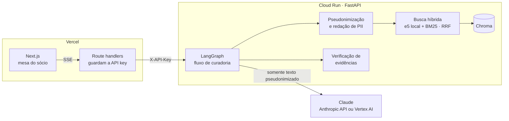
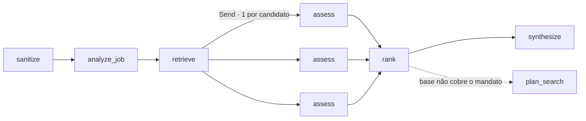
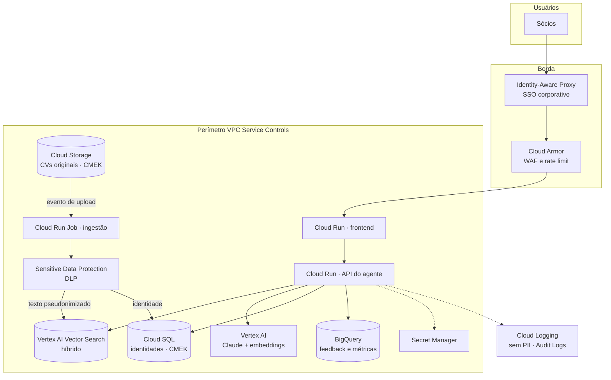

# Arquitetura

## Protótipo (este repositório)

### Fluxo do agente

| Nó | Tipo | O que faz |
|---|---|---|
| `sanitize` | código | Remove e-mail, telefone, CPF/CNPJ, URLs e nomes conhecidos da vaga |
| `analyze_job` | LLM | Estrutura o mandato: requisitos essenciais/desejáveis e consultas de busca |
| `retrieve` | código | Busca híbrida com várias consultas (vaga + mandato + consultas geradas) |
| `assess` | LLM, paralelo | Nota por dimensão, evidências com citação literal, lacunas, pontos de entrevista |
| `rank` | código | Confere cada citação no CV, calcula a nota ponderada (pesos por execução), ordena e mapeia a cobertura dos requisitos essenciais |
| `synthesize` | LLM | Parecer comparativo usando só evidências confirmadas |
| `plan_search` | LLM, condicional | Perfis-alvo, segmentos, buscas booleanas e triagem; roda em paralelo ao parecer quando o líder é fraco ou deixa essenciais descobertos |

O LLM entra onde há julgamento. Busca, verificação e ranking ficam em código: são
determinísticos, testáveis e auditáveis.

## Produção no GCP

### Decisões de produção

- **Dados não saem do projeto.** Claude via Vertex AI roda dentro do GCP, sob os termos do
  Vertex (dados do cliente não treinam modelos). O perímetro VPC-SC impede exfiltração para
  outros projetos.
- **Identidade separada do conteúdo.** Nomes e contatos ficam no Cloud SQL, com acesso
  restrito; o índice vetorial e o LLM só recebem texto pseudonimizado. Um vazamento do índice
  não expõe quem são os executivos.
- **DLP na ingestão.** O Sensitive Data Protection substitui a heurística de regex do
  protótipo, com detecção de nomes por NER e tokenização reversível (chave no KMS).
- **CMEK** em Cloud Storage e Cloud SQL, com rotação no Cloud KMS.
- **Acesso por SSO** via IAP; cada consulta fica no Audit Log com o usuário.
- **Ingestão por evento:** upload de CV no bucket dispara um Cloud Run Job que extrai texto,
  aplica DLP, faz chunking e indexa.
- **Feedback dos sócios no BigQuery**, base para medir concordância e recalibrar pesos.

### Custo e latência

Cada análise faz 2 + N chamadas ao LLM (N = shortlist) e leva de 45 a 60 s com Claude Opus 5
e 4 candidatos. As avaliações individuais rodam em paralelo; o streaming mostra o progresso
enquanto isso. Para bases maiores, o shortlist fica limitado (`SHORTLIST_SIZE`) e a triagem
inicial pode usar um modelo menor.
